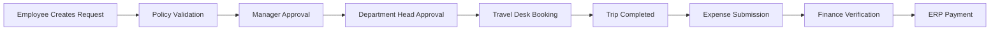
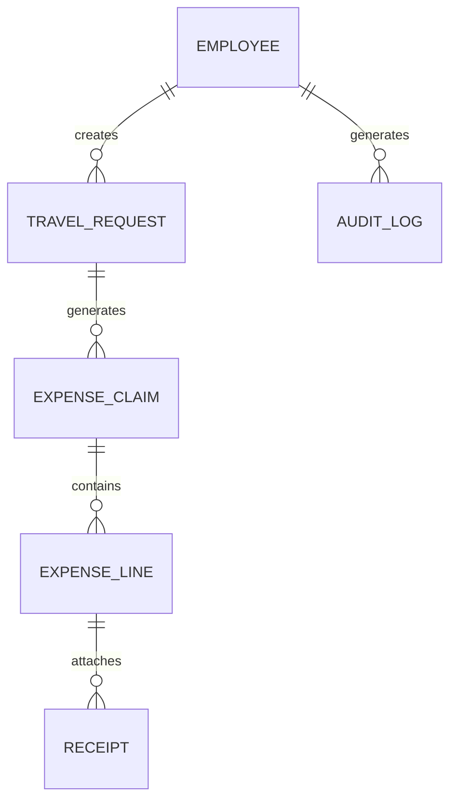

# Enterprise Employee Travel & Expense Management System – Product Requirements Document (PRD)

## Executive Summary
This PRD is generated from the KPI document provided as the source of truth.

### Project Overview
Enterprise Travel & Expense (T&E) platform for 10,000+ employees.

### Business Problem
Manual travel and expense processing through email, spreadsheets, and paper workflows creates delays, compliance risks, and lack of visibility.

### Success Metrics
- 70% reduction in finance effort
- 100% policy validation
- Reimbursement within 5 business days
- 10,000 concurrent users
- 99.9% uptime

---

## KPI Inventory
| KPI Area | Description |
|-----------|------------|
| User Management | Provisioning, RBAC, lifecycle |
| Authentication | SSO, MFA, JWT, audit |
| Travel Management | Request, approval, booking |
| Expense Management | Claims, receipts, verification |
| Reimbursement | ERP integration, payment tracking |
| Compliance | Policy engine, audit, retention |
| Reporting | Dashboards, analytics, reports |
| Mobile | Offline support, OCR, biometrics |
| Security | Encryption, OWASP, GDPR |
| Infrastructure | Scalability, DR, CI/CD |

---

## Technology Stack

### Frontend
- React Native (iOS & Android)
- React.js
- TypeScript
- Redux Toolkit
- React Formik with yup

### Backend
- Node.js 20 LTS
- NestJS Framework
- REST APIs
- JWT Authentication

### Database
- MongoDB Atlas

### Infrastructure
- Docker
- Kubernetes (AWS EKS)
- Redis
- AWS S3
- GitHub Actions

### Integrations
- HRMS
- SAP / Oracle ERP
- AWS Textract OCR
- Firebase Cloud Messaging
- AWS SES

---

This updated PRD supplement explicitly includes:
- Frontend: React Native / React
- Backend: Node.js (NestJS)
- Database: MongoDB

---

## Stakeholders
- Employees
- Managers
- Department Heads
- Finance Team
- Travel Desk
- HR Team
- Auditors
- System Administrators

---

## User Personas
### Employee
Goals:
- Submit travel requests
- Upload receipts
- Track reimbursements

Pain Points:
- Delayed approvals
- Manual paperwork

### Finance Executive
Goals:
- Verify claims
- Generate reimbursements
- Maintain compliance

### Auditor
Goals:
- Review immutable audit trail
- Detect fraud patterns

---

## Scope

### In Scope
- User management
- Authentication
- Travel requests
- Approvals
- Bookings
- Expense claims
- OCR receipts
- Reimbursements
- HRMS integration
- ERP integration
- Reporting
- Mobile apps

### Out of Scope
- Corporate card processing
- Vendor contract management

---

## Functional Requirements Summary

### FR-001 User Management
Business Requirement: Manage 10,000+ employees.
Acceptance:
- Bulk import supported
- Role assignment enforced
- Deactivation within 60 seconds

### FR-002 Authentication
- SSO
- MFA
- JWT
- Session timeout

### FR-003 Travel Request
- Draft support
- Multi-city travel
- Advance requests
- Policy validation

### FR-004 Travel Approval
- Multi-level workflow
- SLA escalation
- Delegation

### FR-005 Expense Claims
- Itemized expenses
- Multi-currency
- Per diem
- Duplicate detection

### FR-006 Receipt Management
- OCR extraction
- Receipt validation
- S3 encrypted storage

### FR-007 Reimbursement
- ERP export
- Batch processing
- Status tracking

---

## Workflow – Travel Request

---

## RBAC Matrix

| Module | Employee | Manager | Finance | Auditor | Admin |
|----------|----------|----------|----------|----------|----------|
| Travel Request | CRUD | View | View | View | Full |
| Approvals | No | Approve | Finance Approval | View | Full |
| Claims | CRUD | View | Verify | View | Full |
| Reports | Own | Team | Org | Audit | Full |

---

## Non-Functional Requirements

### Performance
- Page Load < 3s
- Read APIs < 500ms P95
- Write APIs < 1s P95

### Availability
- 99.9% uptime

### Security
- AES-256
- TLS 1.2+
- OWASP compliance

### Scalability
- 10,000 active users
- Growth to 50,000

---

## Integration Requirements

### HRMS
- Employee sync every 30 minutes
- Auto provisioning
- Separation handling

### ERP
- GL mapping
- Payment confirmation callback
- Budget sync

### OCR
- AWS Textract
- <10 second processing

---

## Data Model

---

## API Catalog

| Endpoint | Method | Description |
|-----------|----------|-------------|
| /auth/login | POST | Login |
| /travel-requests | POST | Create request |
| /travel-requests/{id}/approve | POST | Approval |
| /claims | POST | Submit claim |
| /claims/{id}/verify | POST | Verify claim |
| /reports | GET | Reports |

---

## Reporting Requirements
- Travel Spend by Department
- Policy Violations
- Reimbursement Aging
- Advance Outstanding
- Budget vs Actual

---

## Mobile Requirements
- Offline drafts
- Camera receipts
- OCR
- Push notifications
- Biometrics

---

## Security Requirements
- RBAC
- MFA
- JWT
- Audit logging
- GDPR/PDPA support
- PII masking

---

## Risk Analysis

| Risk | Impact | Mitigation |
|------|--------|-----------|
| HRMS Sync Failure | High | Retry + Alerting |
| ERP Failure | High | Reconciliation |
| OCR Accuracy | Medium | Manual review |
| Load Spike | High | Kubernetes autoscaling |
| Security Breach | Critical | Encryption + WAF |

---

## Release Plan

### MVP
- User management
- Auth
- Travel requests
- Approvals

### Phase 2
- Expense claims
- OCR
- Reimbursements

### Phase 3
- Reporting
- Analytics
- Mobile parity

---

## Traceability Matrix

| KPI Area | Requirement |
|-----------|------------|
| User Management | FR-001 |
| Authentication | FR-002 |
| Travel Request | FR-003 |
| Approval Workflow | FR-004 |
| Expense Claims | FR-005 |
| Receipt Management | FR-006 |
| Reimbursement | FR-007 |

---

## Assumptions
ASSUMPTION: Approval levels are configurable within the 1–3 level KPI definition.

ASSUMPTION: SAP and Oracle are supported ERP targets.

ASSUMPTION: AWS remains the primary cloud platform as defined in the KPI.

---

## Appendix

### Technology Stack
- React 18
- React Native
- NestJS
- MongoDB
- Redis
- AWS S3
- AWS Textract
- Kubernetes
- Terraform

### Compliance Matrix
- GDPR
- PDPA
- OWASP Top 10

### Retention Matrix
- Receipts: 7 Years
- Audit Logs: 7 Years
